# NUTRIFIT REACT - FRONTEND APP

<div align="center">
  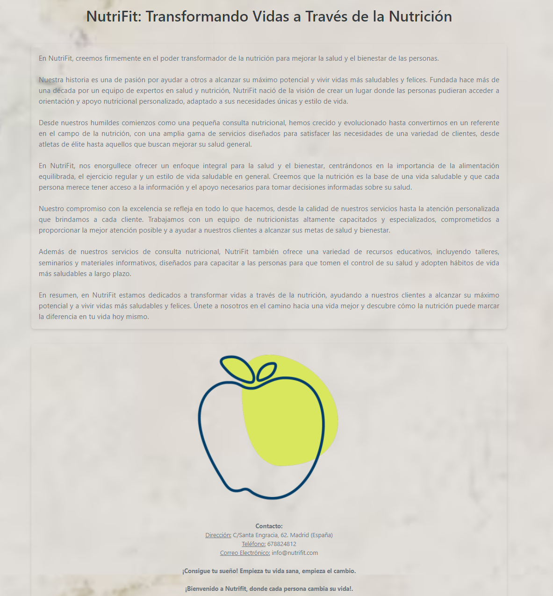
  <h1>NUTRIFIT</h1>
</div>

<details>
  <summary>Contenido 📝</summary>
  <ol>
    <li><a href="#objetivo">Objetivo</a></li>
    <li><a href="#sobre-el-proyecto">Sobre el proyecto</a></li>
    <li><a href="#stack">Stack</a></li>
    <li><a href="#funcionalidades">Funcionalidades</a></li>
    <li><a href="#instalación-en-local">Instalación</a></li>
    <li><a href="#futuras-funcionalidades">Futuras funcionalidades</a></li>
    <li><a href="#contribuciones">Contribuciones</a></li>
    <li><a href="#licencia">Licencia</a></li>
    <li><a href="#webgrafia">Webgrafia</a></li>
    <li><a href="#desarrollo">Desarrollo</a></li>
    <li><a href="#agradecimientos">Agradecimientos</a></li>
    <li><a href="#contacto">Contacto</a></li>
  </ol>
</details>

## Objetivo

Este proyecto está conectado a mi base de datos a través de la API Rest que hice anteriormente.
Link repositorio del backend: https://github.com/albertomargut/NutriFit.git

## Sobre el proyecto

Mi proyecto ofrece una solución integral para conectar a los clientes con nutricionistas calificados, facilitando la programación de citas y mejorando la accesibilidad a los servicios de salud y bienestar nutricional. Con la función de planes nutricionales en desarrollo, la plataforma también tiene como objetivo proporcionar un valor añadido al ofrecer recursos prácticos y personalizados para mejorar la salud y el estilo de vida de los usuarios.

## Stack

Tecnologías utilizadas:

- JAVASCRIPT
- REACT.JS
- REDUX
- REACT BOOTSTRAP
- SQL/MySQL
- EXPRESS
- DOCKER
- NODE.JS
- TYPESCRIPT
- TYPEORM

## Funcionalidades

<details>
  <summary>Inicio</summary>
  <ol>
  <li align="center">🔐 Home (vista Móvil)/ Registrarse / Login</li>
      <div align="center">
      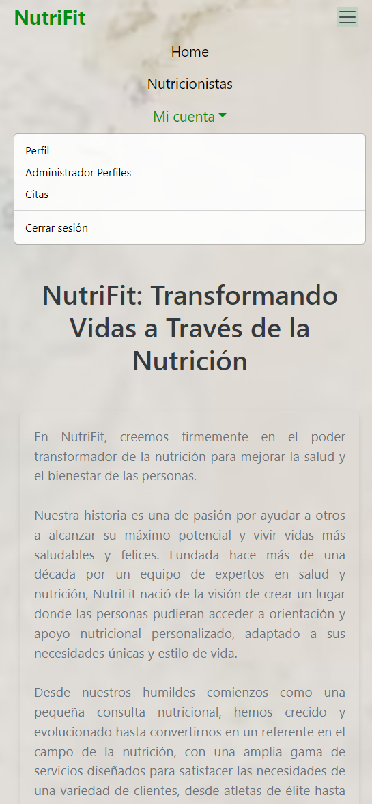
      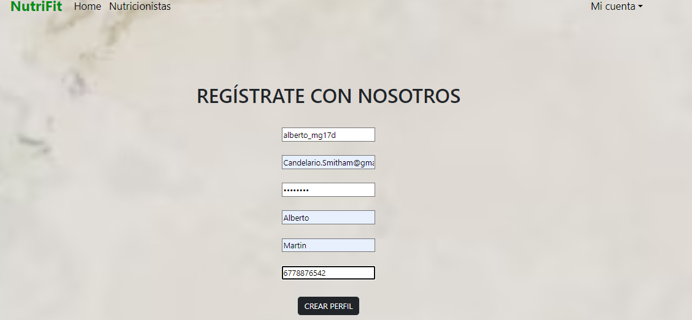
      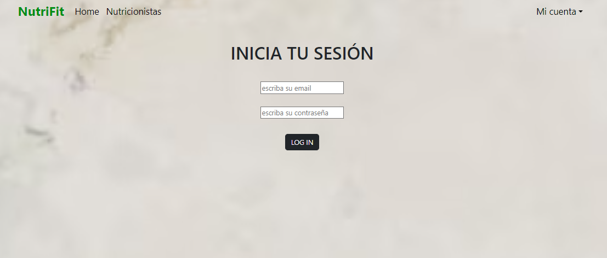
      </div>
      <br><br>
  <summary>Cliente 🙋🏽‍♂️</summary> 
    <li align="center">📝 Crear Cita / Ver-Editar-Borrar Cita</li>
      <div align="center">
      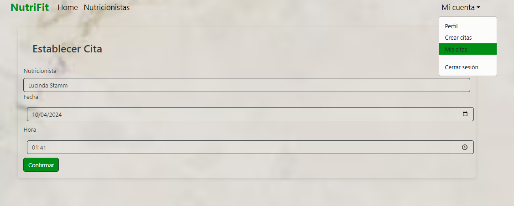
      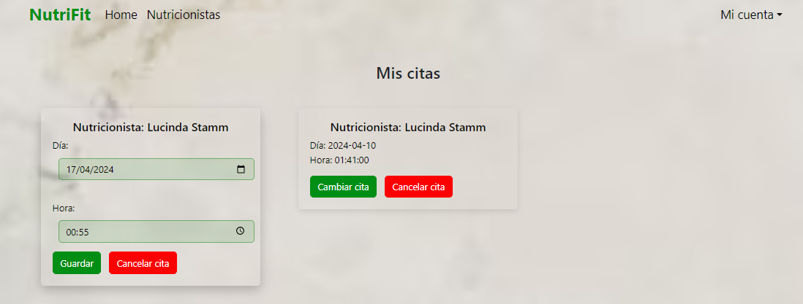
      </div>
      <br><br>
  <summary>Nutricionista 🙋🏽</summary>   
    <li align="center">📝 Visualización Citas / Sobre Nutricionistas</li>
      <div align="center">
      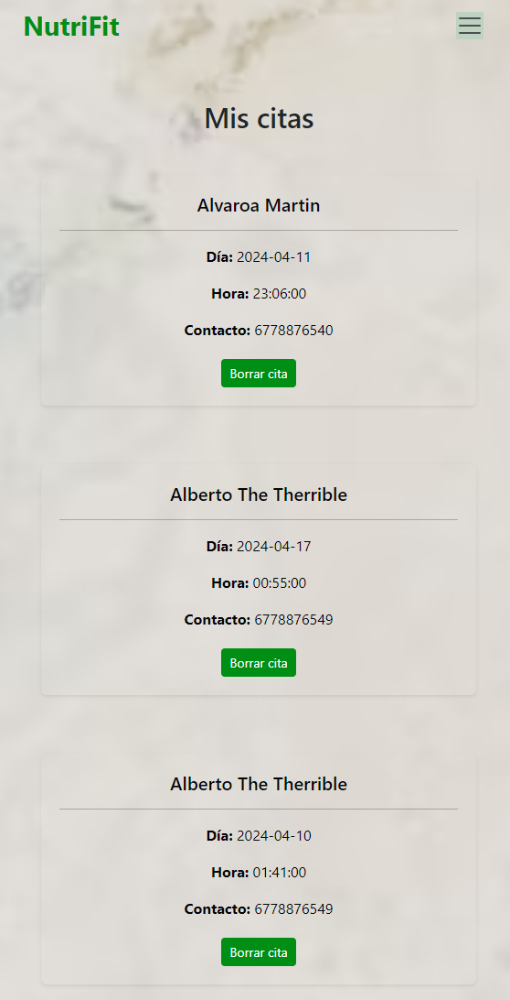
       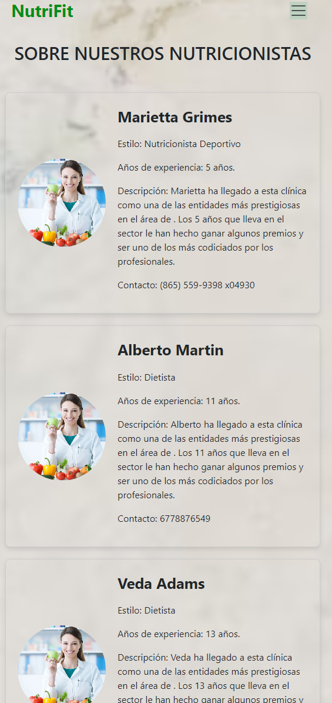
      </div>
      <br><br>
  <summary>Admin 🙋🏽</summary>   
    <li align="center">📝 Ver Todos los Usuarios (Puede Borrarlos) / Ver todas las citas</li>
      <div align="center">
      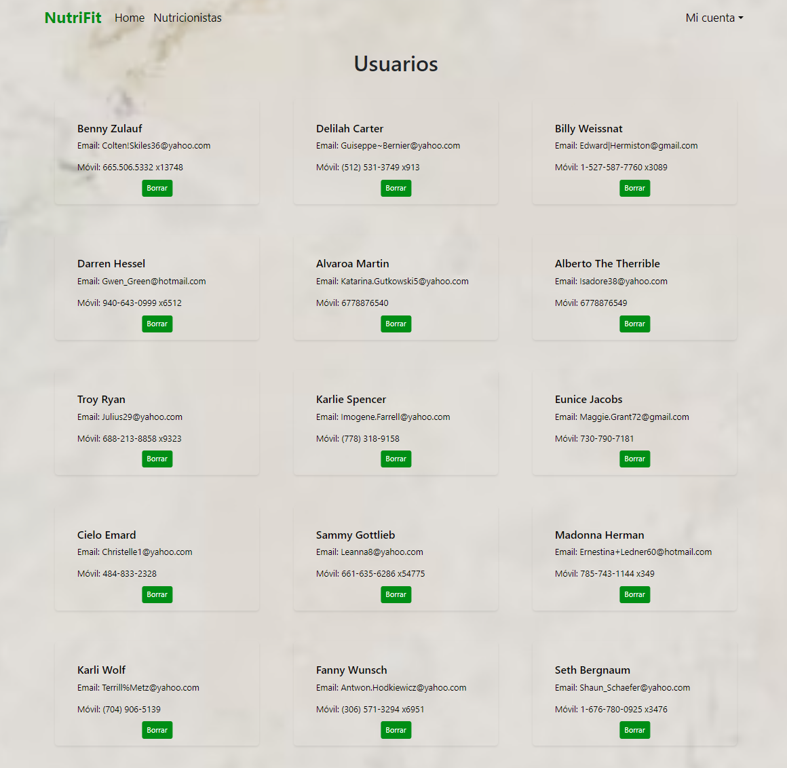
      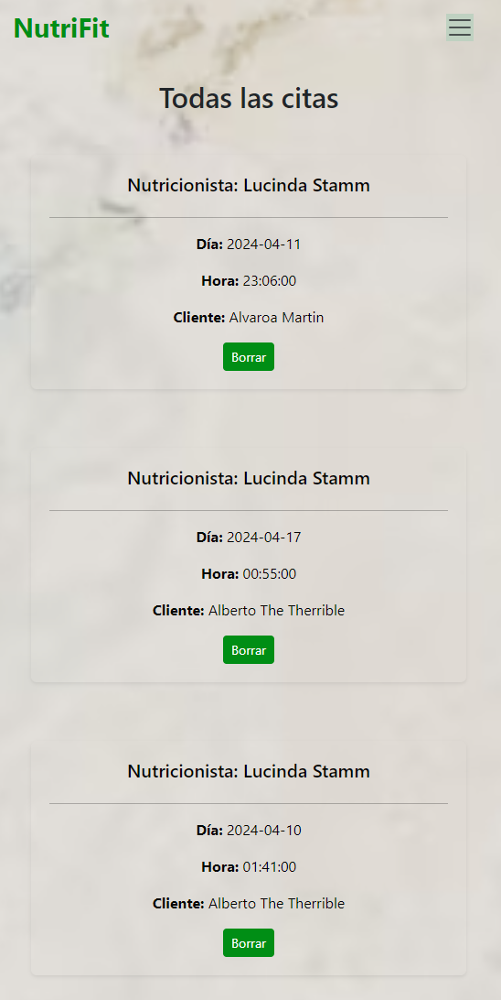
      </div>
      <br><br>
  <summary>Admin/Cliente/Nutricionista 🙋🏽‍♂️🙋🏽</summary> 
     <li align="center">👀 Visulazación de su perfil y posibilidad de cambiar los datos</li>
      <div align="center">
      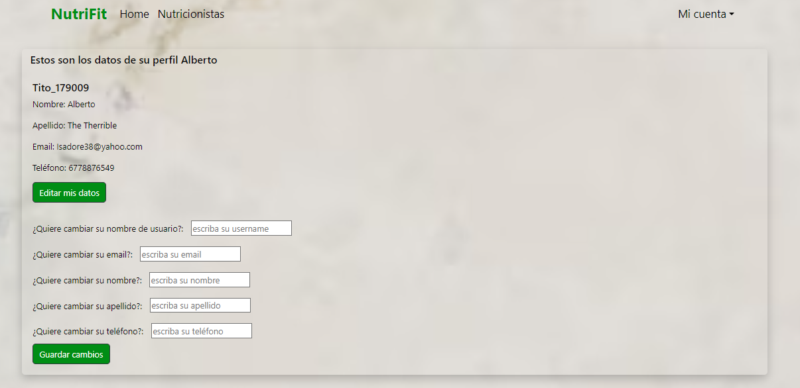
      </div>
      <br><br> 
  </ol>
</details>

## Puesta en marcha

1. Clonar el repositorio: https://github.com/albertomargut/NutriFit.git
2. `$ npm install`
3. Conectamos nuestro repositorio con la base de datos
4. Iniciamos nuestra DB y nuestra API Rest
5. Iniciamos nuestro frontal: Navegamos al repositorio del frontend and y lo iniciamos con `npm run dev` para comenzar el frontend.
Lo mismo sería con el backend, inicializandolo con `npm run dev`.

La aplicación será accesible vía [http://localhost:5173/] para el frontend y [http://localhost:3000/]para el backend.

## Contribuciones

Las sugerencias y aportaciones son siempre bienvenidas.

Puedes hacerlo de dos maneras:

1. Abriendo una issue
2. Crea un fork del repositorio
   - Crea una nueva rama
     ```
     $ git checkout -b feature/nombreUsuario-mejora
     ```
   - Haz un commit con tus cambios
     ```
     $ git commit -m 'feat: mejora X cosa'
     ```
   - Haz push a la rama
     ```
     $ git push origin feature/nombreUsuario-mejora
     ```
   - Abre una solicitud de Pull Request

## Futuras funcionalidades

[ ] Creación de planes nutricionales para los clientes

## Licencia

Este proyecto se encuentra bajo licencia de "Alberto Martín"

## Webgrafia:

Para conseguir mi objetivo he recopilado información de:

- Documentacion propia del curso GeeksHubs junto con las sesiones grabadas.
- Documentacion propia de TypeOrm
- https://www.npmjs.com/package//typeorm

## Desarrollo:

```js
const developer = "Alberto Martín";

console.log("Desarrollado por: Alberto Martín" + developer);
```

## Agradecimientos:

Agradezco a mis compañeros el tiempo dedicado a este proyecto:

- **Todos mis profesores y compañeros que me han acompañado en este proceso**

## Contacto

<a href = "alberto.martinguti@gmail.com"></a>
